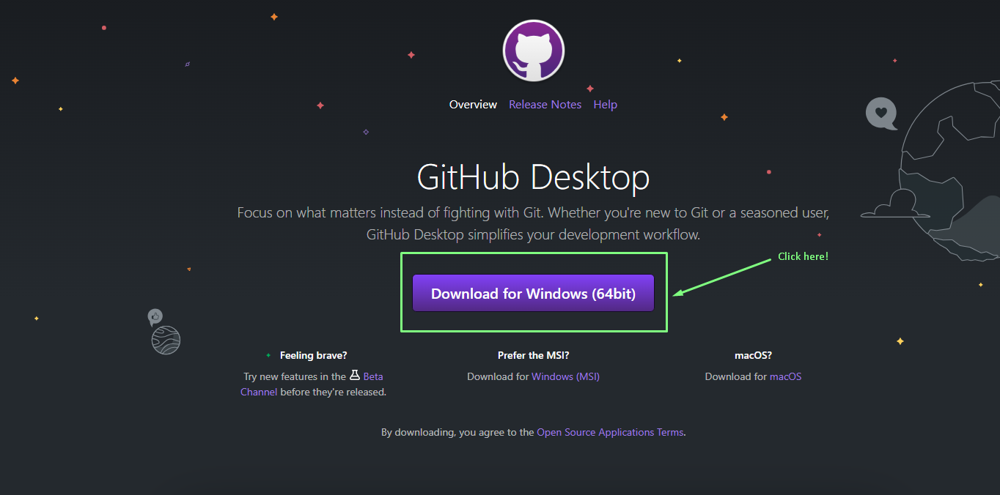
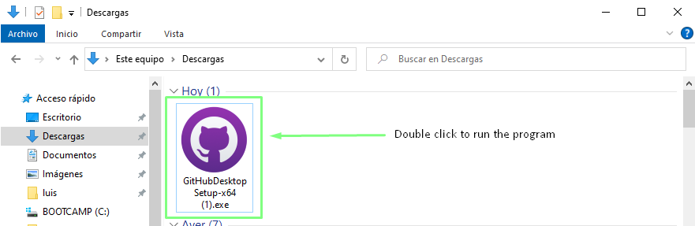
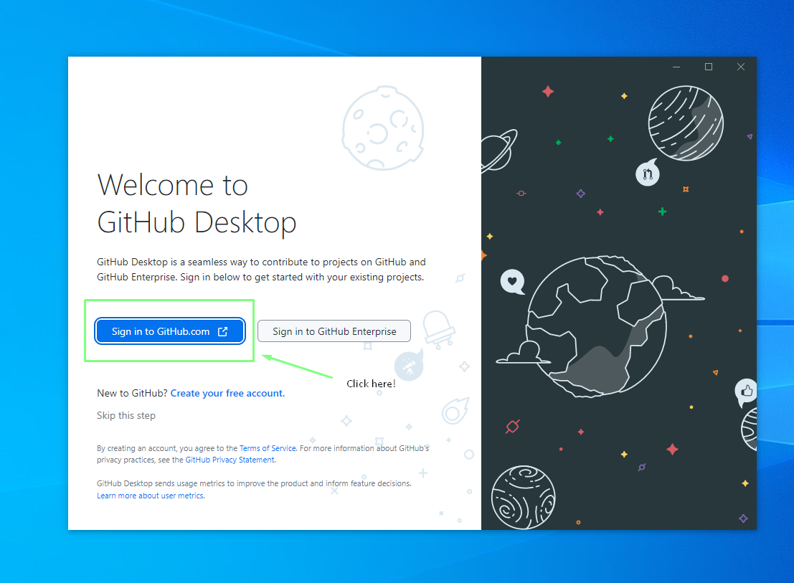
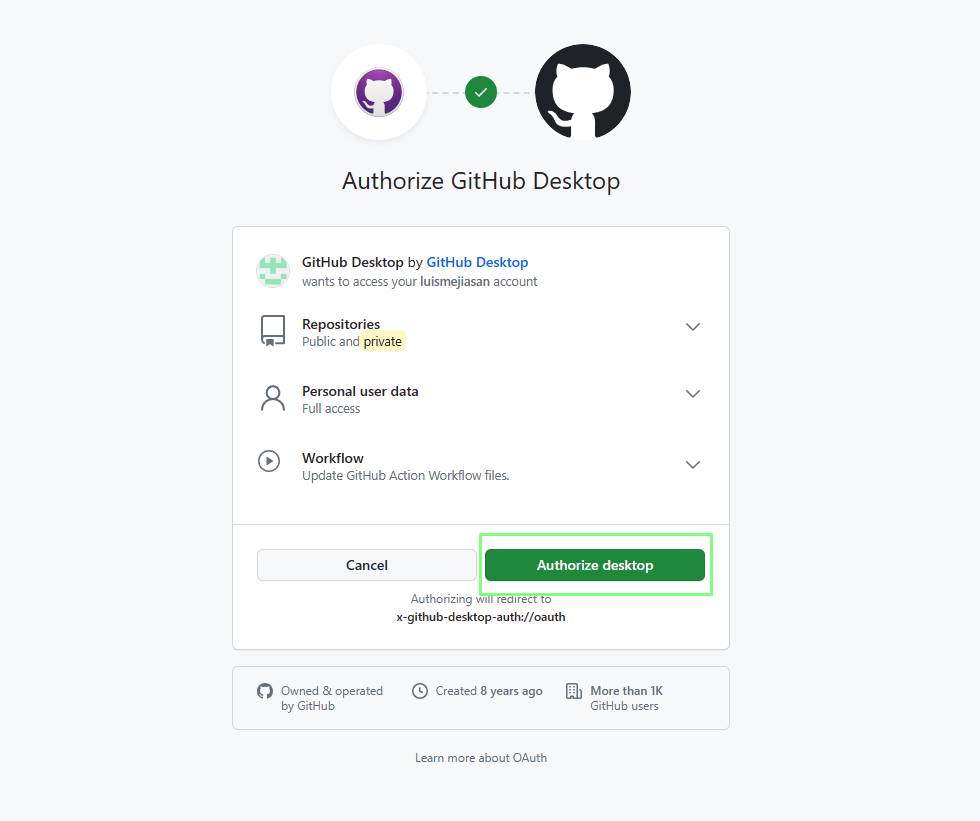

# How to install and authenticate GitHub Desktop on Windows

## Introduction of the project

GitHub Desktop is a powerful tool that simplifies the process of collaboration and project management using Git and GitHub. With an intuitive and easy-to-use interface, GitHub Desktop makes it easy to create, clone, and manage repositories, letting you focus on software development without the complexity of command line commands.

This guide will take you through the steps required to install GitHub Desktop on your Windows operating system. You'll learn how to download the installer, set up the tool, and make initial settings to start getting the most out of this collaborative development platform.

## Previous requirements

Before you begin installing GitHub Desktop, make sure you meet the following requirements:

- A Windows operating system (Windows 7 or higher).
- Internet access to download the installer.
- A GitHub account (if you don't already have one, you can create one for free at https://github.com).

### Installation process in Windows

Here are the steps you need to follow to install GitHub Desktop on your Windows system:

1.  Download the Installer: Access the official GitHub Desktop site at https://desktop.github.com/ and download the installer by clicking "Download for Windows".

    

2. Run the installer: Locate the downloaded file, usually called GitHubDesktopSetup.exe, and double-click it to run it.

    
    - When executed, a screen like the following will appear:
    

3. Installation: Follow the instructions of the installation wizard, accepting the license terms and choosing the installation options.
    - We select the option to enter github.com
    

    > **NOTE**  
    If you select the "GitHub Enterprise" option when logging in, you can enter the URLs and credentials of your GitHub Enterprise instance instead of using GitHub.com. This is useful for organizations that have deployed their own GitHub Enterprise instance and want to manage their repositories and workflows in their controlled environment.    
        

    
    -  When making the selection, a page like the following will open, in which we must enter our email and password that we have registered in GitHub. After entering these data we select the "Sign in" button.

        ](imgs/Screenshot_17.png)

    - We select the button for the synchronization of GitHub Desktop and the GitHub website
         

4. Sign in: After installation, start GitHub Desktop and sign in with your GitHub account.

5. Initial Configuration (Optional): Customize GitHub Desktop preferences to suit your needs.

