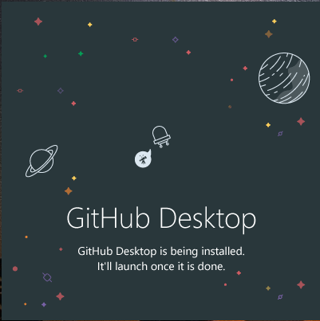

# How to install and authenticate GitHub Desktop on Windows

## Introduction of the project

GitHub Desktop is a powerful tool that simplifies the process of collaboration and project management using Git and GitHub. With an intuitive and easy-to-use interface, GitHub Desktop makes it easy to create, clone, and manage repositories, letting you focus on software development without the complexity of command line commands.

This guide will take you through the steps required to install GitHub Desktop on your Windows operating system. You'll learn how to download the installer, set up the tool, and make initial settings to start getting the most out of this collaborative development platform.

## Previous requirements

Before you begin installing GitHub Desktop, make sure you meet the following requirements:

- A Windows operating system (Windows 7 or higher).
- Internet access to download the installer.
- A GitHub account (if you don't already have one, you can create one for free at <https://github.com>).

### Installation process in Windows

Here are the steps you need to follow to install GitHub Desktop on your Windows system:

1. Download the Installer: Access the official GitHub Desktop site at <https://desktop.github.com/> and download the installer by clicking "Download for Windows".

    

2. Run the installer: Locate the downloaded file, usually called GitHubDesktopSetup.exe, and double-click it to run it.

    
    - When executed, a screen like the following will appear:
    

3. Installation: Follow the instructions of the installation wizard, accept the license terms and choose the installation options.
    - We select the option to enter github.com
    

    > **NOTE**  
    If you select the "GitHub Enterprise" option when logging in, you can enter the URLs and credentials of your GitHub Enterprise instance instead of using GitHub.com. This is useful for organizations that have deployed their own GitHub Enterprise instance and want to manage their repositories and workflows in their controlled environment.

4. Sign in: After installation, start GitHub Desktop and sign in with your GitHub account.

    - When making the selection, a web page like the following will open, in which we must enter the email and password that we have registered in GitHub. After entering these data we select the "Login" button.

        ](imgs/Screenshot_17.png)

    - We select the "Authorize desktop" button to sync GitHub Desktop and the GitHub website.

         

5. Initial Configuration (Optional): Customize GitHub Desktop preferences to suit your needs.
    - Enter your username and password.

        

    > **NOTE**  
    Usually the platform autofills the fields when we select the option "Use my GitHub account name and email address".

    - GitHub Desktop gives you options to start working with Git repositories on your local computer. You can choose the option that best suits your current needs and start collaborating on software development projects.

#### Clone a Repository

This option allows you to clone (download) a GitHub repository to your local computer. Simply provide the URL of the repository you want to clone and select the location on your computer where you want to save the repository.

#### Create a Repository

If you want to start a new project, you can create a repository from scratch directly from GitHub Desktop. This will set up a new local repository and allow you to commit and push changes to a remote GitHub repository.

#### Add an Existing Repository

If you already have a Git repository on your local computer that you want to manage with GitHub Desktop, you can select this option. Just choose the folder where the repository is located and GitHub Desktop will recognize it.

- This time ***Clone a Repository*** will be used.

    

- On this page we can see how 'GitHub Desktop' clones the repositories we have on 'GitHub.com'

    

#### Current Repository

This is the selection of the repository you are currently configuring. GitHub Desktop displays the name of the repository that you are cloning from your GitHub account or that you have previously cloned to your local computer. You can change the current repository by clicking the "Choose a different repository" button if you want to work in another repository.

#### Current Branch

A branch in a Git repository is an independent line of development. The "current branch" refers to the branch you currently have selected to work on in your local copy of the repository. When you clone a repository, by default, GitHub Desktop places you in the default branch of the repository, usually called "main" or "master". However, you can change the current branch if you want to work on a different branch. Branches are useful for developing new features or fixing bugs without affecting the main branch of the repository.

#### Publish Branch

The "Publish Branch" option is used when you want to share your changes to a specific branch with the remote repository on GitHub.com or on your GitHub Enterprise server. When you click "Publish Branch," the changes you've committed to that branch are pushed to the remote repository, allowing other collaborators to access and work on those changes collaboratively. This is essential for collaboration on software development projects.

## In summary

With GitHub Desktop installed on your system, you're ready to start working collaboratively and managing your repositories more efficiently.

Follow this step-by-step guide and you'll be on your way to taking full advantage of GitHub Desktop's capabilities in your development workflow!
